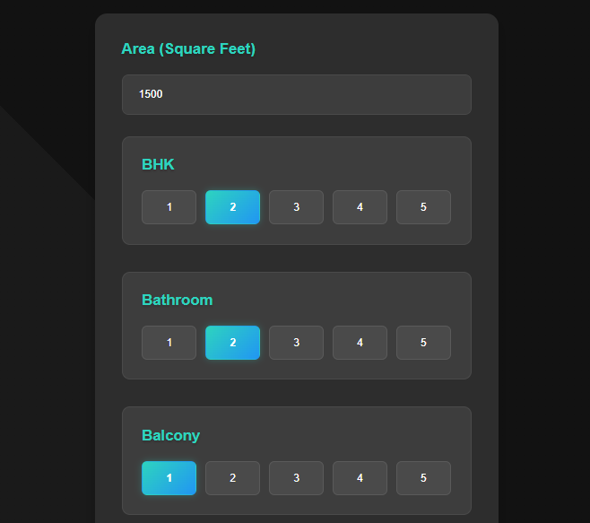
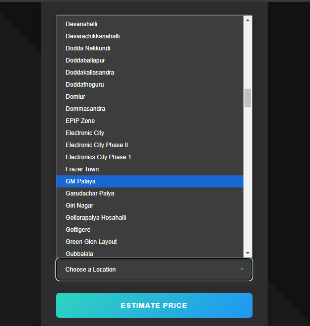
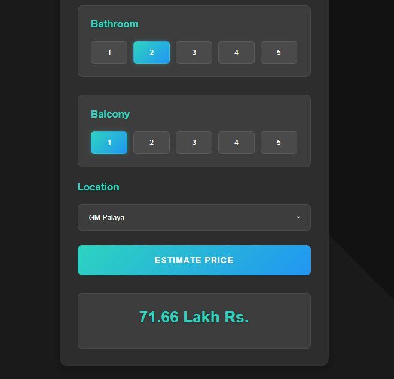

# Bangalore House Price Prediction Model

This project is a Flask-based web application that lets users predict house prices based on inputs such as total square feet, location, number of bathrooms, balconies, and BHK. The application serves a modern frontend interface (HTML/CSS/JS) along with REST API endpoints to retrieve data such as available locations and estimated prices.
The dataset was downloaded from: https://www.kaggle.com/amitabhajoy/bengaluru-house-price-data

---

## Project Structure
```
House Price Prediction Model/
├── client/
│   ├── app.html               # Main HTML file for the web interface
│   ├── app.css                # CSS styles for the web interface
│   ├── app.js                 # JavaScript file for interactive functionalities
│   ├── step1.png              # Image for step 1
│   ├── step2.png              # Image for step 2
│   └── step3.png              # Image for step 3
├── model/
│   └── BHP.ipynb              # Jupyter Notebook for the house price prediction model
├── server/
│   ├── artifacts/
│   │   ├── banglore_home_prices_model.pickle   # Pickled model file
│   │   ├── colums.json                          # JSON file with column information
│   │   └── cleaned_data.csv                     # CSV file with cleaned data
│   ├── server.py               # Flask server with all API endpoints and static routes
│   └── util.py                 # Utility file containing functions for model predictions and data processing
├── Bengaluru_House_Data.csv     # CSV file containing Bengaluru house data
├── requirements.txt           # Python dependencies list (e.g., Flask)
└── README.md                  # Project documentation

```

---

## Application Interface

Below are the steps to use the web interface:

### 1. Enter area, BHK, bathroom, and balcony


### 2. Select the location from the dropdown menu


### 3. Click on estimate price button and the estimated price is displayed on the result box


---

## Model Performance

To achieve robust predictions, I performed extensive hyperparameter tuning and then stacked a hyperparameterised XGBoost model with a Linear Regression model. The combined model achieved the following performance metrics:

- **Training R²:** 0.915  
- **Testing R²:** 0.914  
- **Mean Cross Validation Score:** 0.855 
- **RMSE:** 26.518  

These results indicate that the model generalizes well with accurate predictions, which is a very good outcome for this type of house price prediction task.

---

## How It Works

### Main Entry Point
When a user accesses `http://127.0.0.1:5000/`, the Flask server serves the `app.html` file from the client directory. This HTML file is rendered on the browser along with the associated CSS and JavaScript files.

### Static File Serving
The server is configured with two important routes:
- `/<path:filename>`: Serves any files (e.g., `app.js`, `app.css`) directly from the client directory.
- `/client/<path:path>`: An alternate route to serve static files present in the client folder.

These routes ensure that when the HTML references `app.js` or `app.css` (using relative paths like `/app.js` or `/app.css`), the files are found and served correctly.

### REST API Endpoints
- **`/get_location_names` (GET):** Returns a JSON object with a list of locations. It uses `util.get_location_names()` to fetch available locations.
- **`/predict_home_price` (GET, POST):** Takes form data (total_sqft, location, bath, balcony, bhk) and returns the estimated house price in JSON format. It uses `util.get_estimated_price()` to compute the prediction.

### Utility Functions
The `util.py` file is responsible for loading saved artifacts and providing helper functions to compute predictions and retrieve data.

---

## Getting Started

### Prerequisites
- Python 3.6 or higher
- pip
- (Optional) Virtual Environment tool (e.g., venv)

### Installation

#### Clone the Repository
```sh
git clone https://github.com/AdityaJollyy/Bangalore-House-Price-Prediction-Model.git
cd House-Price-Prediction-Model
```

#### Create and Activate a Virtual Environment

**On Windows:**
```sh
python -m venv venv
venv\Scripts\activate
```

**On macOS/Linux:**
```sh
python3 -m venv venv
source venv/bin/activate
```

#### Install Required Packages
Run:
```sh
pip install -r requirements.txt
```

---

## Running the Application

### Start the Flask Server
Navigate to the project directory and run:
```sh
python server/server.py
```

### Access the Application
Open your browser and go to `http://127.0.0.1:5000` to load the `app.html` page. The CSS and JavaScript should load correctly using the defined static file routes.

---

## Contributing
Contributions to the project are welcome. Feel free to open issues or submit pull requests with improvements and bug fixes.

